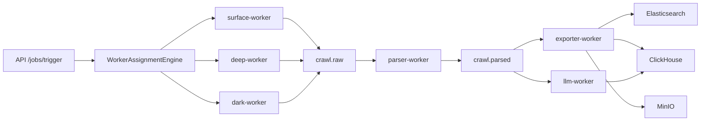

# Pipeline overview

The current implementation uses the shared recursive crawl helper in [app/services/recursive_crawl_service.py](../../app/services/recursive_crawl_service.py) for all crawl workers, with a default max depth of 5 and Redis Bloom deduplication. The parser worker now uses the Amharic modules in [app/amharic](../../app/amharic) to clean, detect language, score quality, and emit parsed content. The Airflow scheduler and React UI directories are present in the repository but are not wired into the current Compose stack, so they should be treated as planned or aspirational rather than active runtime components.
